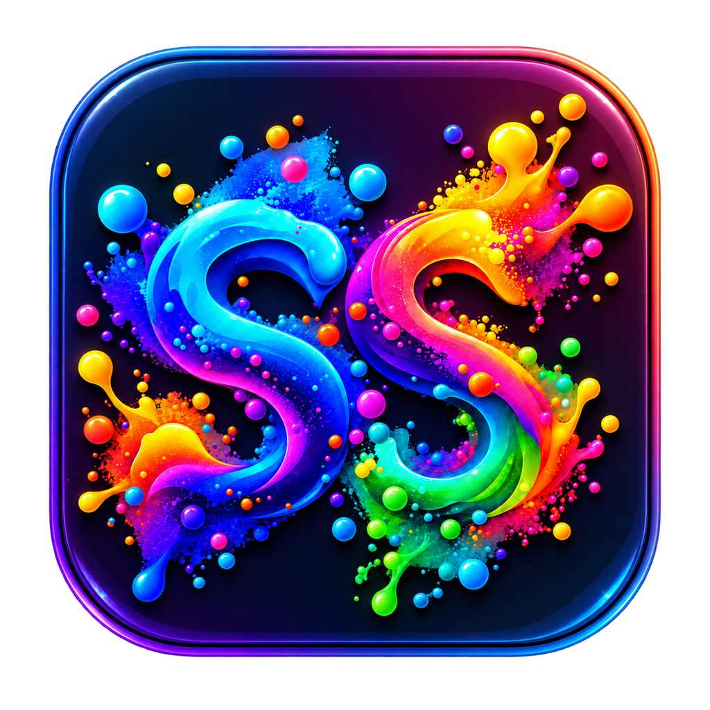

# Splat Studio

<p align="center">
  
</p>

<p align="center">
  <strong>Local 3D Gaussian Splat reconstruction for Apple Silicon.</strong>
</p>

<p align="center">Created by <strong>blondothenerd</strong>.</p>

Splat Studio is a local macOS workstation for creating, reviewing and editing
**3D Gaussian Splats** from videos or still-photo sets.

It combines **COLMAP camera reconstruction**, a native **MLX / C++ / Metal**
Gaussian Splatting backend, optional **AI-assisted preprocessing**, resumable
training, live previews and **SuperSplat** editing in one interface.

## Highlights

- Video or still-photo reconstruction
- Smart frame/photo curation
- COLMAP sparse reconstruction and automatic camera rescue
- Native Apple Silicon MLX / C++ / Metal Gaussian training
- Full-scene initialization from COLMAP sparse points
- Optional Depth Anything V2 assistance
- Optional semantic masking
- Training snapshots and resume
- Unattended automatic retry after training errors
- Lightweight live training previews
- Ten reconstruction profiles
- SuperSplat review, editing and fullscreen viewing
- Recommended camera viewpoints
- Automatic orientation correction
- Local project management
- Dark, Light and Custom themes
- Local-only project storage

## Platform

Splat Studio currently targets:

- macOS
- Apple Silicon
- full Xcode installation
- Apple Metal toolchain
- Homebrew

The packaged installer currently targets Apple Silicon Macs. Intel Macs are not currently supported. Windows & Linux miss out unfortunately.

## Installation

### 1. Install Xcode

Install the full version of **Xcode** and open it at least once.

Then:

```bash
sudo xcode-select --switch /Applications/Xcode.app/Contents/Developer
sudo xcodebuild -runFirstLaunch
xcodebuild -downloadComponent metalToolchain
```

Verify:

```bash
xcode-select --print-path
xcrun --find metal
xcodebuild -version
```

### 2. Install Homebrew

Install Homebrew if it is not already available.

Splat Studio uses Homebrew-provided tools such as COLMAP, FFmpeg, CMake and
Node where required.

### 3. Clone Splat Studio

```bash
git clone https://github.com/YOUR-GITHUB-USERNAME/SplatStudio.git
cd SplatStudio
```

### 4. Install

Double-click:

```text
Install Splat Studio.command
```

or run:

```bash
chmod +x "Install Splat Studio.command"
./"Install Splat Studio.command"
```

The installer creates Splat Studio's local runtime/backend and installs the
required dependencies.

### 5. Launch

Double-click:

```text
Launch Splat Studio.command
```

The Streamlit interface will open in your browser.

## Optional AI setup

If AI components were not installed during the main setup, run:

```text
Setup AI Vision.command
```

AI models are stored locally and are excluded from Git.

## Video and photo sources

Splat Studio supports:

- MP4
- MOV
- M4V
- JPG / JPEG
- PNG
- WebP
- TIFF

Video sources are sampled automatically.

Photo sets are normalized for EXIF rotation and can use exhaustive COLMAP
matching for smaller unordered image sets.

## Native Metal training

The Gaussian training engine uses `a1091150/gsplat-mlx`.

Training initializes from reconstructed COLMAP sparse geometry and then performs
adaptive Gaussian optimization using MLX and native Metal acceleration.

## Snapshots and recovery

Splat Studio can periodically save recovery snapshots containing training state.

Features include:

- configurable snapshot intervals
- resume from the latest compatible snapshot
- total runtime tracking
- safe Stop behavior
- automatic retry after worker errors
- lower-pressure retry modes where appropriate

## Live previews

Training can periodically render a small preview image.

Preview size and frequency are deliberately limited so the preview does not
substantially interfere with training performance.

## AI-assisted preprocessing

Optional local AI features include:

- Depth Anything V2 Small depth assistance
- semantic masking
- smart source-image selection

AI assistance is optional. If an optional AI preprocessing stage fails,
Splat Studio can continue with normal COLMAP + native Metal training.

## SuperSplat

Splat Studio can:

- preview results
- open the local SuperSplat editor
- launch a fullscreen viewer
- calculate a recommended source-camera viewpoint
- correct generated scene orientation
- prepare viewer-compatible cached assets

## Project management

Projects can be:

- opened
- reviewed
- revealed in Finder
- restarted
- deleted/moved to Trash

## Local file layout

The GitHub repository should contain source and installation files only.

These directories are created locally and should not be committed:

```text
SplatStudio/
├── backend/
├── runtime/
├── models/
├── projects/
└── .splat_studio/
```

They contain compiled dependencies, model caches, project data, settings and
logs.

## Privacy

Splat Studio is designed as a **local reconstruction workstation**.

Source videos, photographs, reconstruction data and generated splats remain on
the user's computer during the normal workflow.

Optional AI models are downloaded from their upstream providers, but inference
runs locally after installation.

## Output

The native workflow primarily produces:

- `.spz`
- `.ply` viewer caches
- COLMAP reconstruction data
- training snapshots
- preview images
- reconstruction metadata

## Capture tips

### Video

- move smoothly
- keep the scene in view
- maintain strong overlap between neighboring views
- avoid heavy motion blur
- avoid sudden viewpoint jumps

### Photos

- capture many overlapping viewpoints
- move gradually around the scene
- keep common textured features visible
- avoid large gaps between adjacent positions
- avoid excessive duplicate images

## Troubleshooting

### Too few COLMAP cameras register

Try:

- a stronger reconstruction profile
- more overlapping views
- steadier footage
- sharper source images
- more scene texture
- automatic camera rescue

Splat Studio intentionally refuses to train if the camera solve is too weak to
produce a useful Gaussian scene.

### Training error

If a compatible snapshot exists, Splat Studio can resume from the latest saved
state. Automatic recovery can also retry using a lower-pressure configuration.

### Viewer is blank

Splat Studio can generate a viewer-compatible cached representation of SPZ
results. The SuperSplat editor remains available as a fallback.

## Updating

```bash
git pull
```

Projects, models and local settings are kept outside tracked source files.

## License

Splat Studio's original source code is released under **The Unlicense**.

See [`LICENSE`](LICENSE).

### Third-party licenses

Third-party software and model weights retain their own licenses.

Key examples:

- `a1091150/gsplat-mlx` — MIT
- PlayCanvas SuperSplat — MIT
- Depth Anything V2 Small — Apache-2.0
- NVIDIA SegFormer — separate NVIDIA license with a **non-commercial
  research/evaluation** restriction

The optional SegFormer model does not change the public-domain dedication of Splat Studio's own code, but users enabling it must comply with NVIDIA's separate terms.

If you want a fully commercial-friendly configuration, disable or replace the
SegFormer model with a permissively licensed alternative.

See [`THIRD_PARTY_NOTICES.md`](THIRD_PARTY_NOTICES.md).

## Credits

Splat Studio builds on excellent open-source and research projects including:

- COLMAP
- MLX
- `gsplat-mlx`
- PlayCanvas SuperSplat
- FFmpeg
- Streamlit
- Depth Anything V2
- Hugging Face Transformers

Please support and cite the upstream projects where appropriate.

## Contributing

Issues and pull requests are welcome.

See [`CONTRIBUTING.md`](CONTRIBUTING.md).
